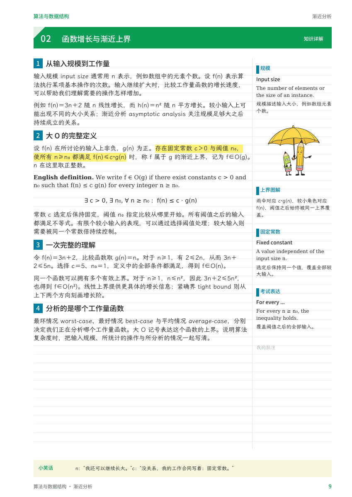
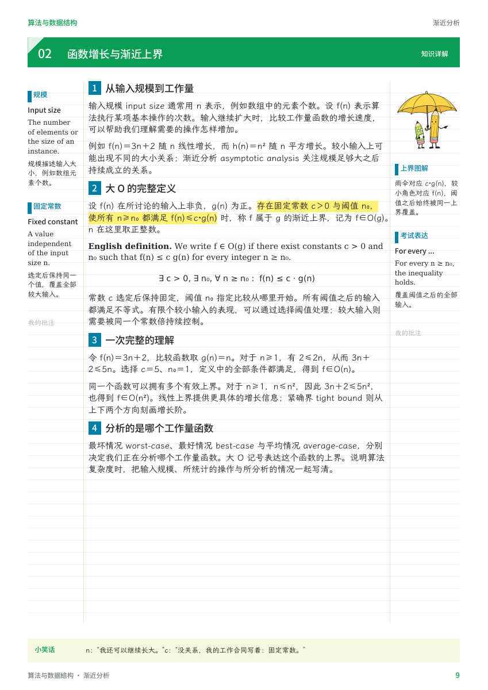

# 大学学霸笔记 · University Xueba Notes

把大学课程整理成可以反复通读的完整知识笔记，并按书写方式选择打印版或电子批注版。

正文围绕定义、条件、直觉、推导与应用展开，配合扩展中英术语、完整英文例题、自测与完整答案、手绘概念插图和每页一两行的趣味页脚。

## 生成前的两个选项

**你准备怎样使用这份笔记？**

| 选项 | 批注布局 | 适合用途 |
| --- | --- | --- |
| 打印后手写批注 | 奇数页右侧、偶数页左侧的一条 45 mm 批注栏；书脊侧留白 20 mm | 双面打印、装订、纸上书写 |
| 在电脑或平板上批注 | 每页固定左右两个批注栏，宽 22 / 28 mm | PDF 阅读、电脑批注、平板手写 |

明确选择后沿用同一模式；需要两版时使用同一份知识稿，分别排版。

## 预览与完整样稿

| 打印版 | 电子批注版 |
| --- | --- |
|  |  |
| [打印版规范与连续样稿 PDF](skills/artifact-template-university-xueba-notes/assets/examples/print-reference.pdf) | [电子批注版规范与连续样稿 PDF](skills/artifact-template-university-xueba-notes/assets/examples/digital-reference.pdf) |

每份 PDF 均为 14 页，包含版式规范和六页连续章节样稿：渐近分析的完整讲解、八项扩展术语及英文例句、完整英文证明、四道自测和逐题完整英文答案。

## 核心要求

- 完整、连贯的基础知识正文，适合初学和多次通读。
- 中文解释配扩展英文术语：名称、含义、英文定义、概念关系、考试表达。
- 例题题目与完整解答使用英语；每项自测和每个小问都有完整答案。
- 大章节数字和长绿标题条只在新章节首页出现；续页正文与批注向上延伸。
- 页码奇右偶左；打印版批注和页码同侧，并保留内侧装订空隙。
- 页眉页脚采用具体科目名或省略通用名称。
- 每页一则名言、冷知识或短笑话，最多两行，题材不限于科目。
- 使用 handraw-style 第 103 项提示词调用生图功能，生成后嵌入笔记；精确公式和图形单独排版。

## 使用这个 skill

完整 skill 位于 [`skills/artifact-template-university-xueba-notes`](skills/artifact-template-university-xueba-notes)。保留整个目录，使参考文档、脚本、插图、布局说明和许可证可以按相对路径找到。

在支持 personal skills 的 AI 助手中导入整个目录，或让助手读取该目录的 `SKILL.md`。同时提供课程大纲、讲义、教材或练习资料，并指定使用方式。例如：

> 使用大学学霸笔记，把这门课的材料整理成可以反复通读的笔记。我会打印装订后手写批注，考试用英语。

> 使用大学学霸笔记，整理算法的渐近分析章节。我在平板上写批注，请使用电子批注版。

> 使用大学学霸笔记，按同一份知识稿生成打印版和电子批注版。

未指定方式时，skill 会先提供上面的两个选项。根据任务使用相应文档/PDF能力、生图能力和可视化检查流程。

## 文件组织

```text
skills/artifact-template-university-xueba-notes/
  SKILL.md                         主流程、两种用途选择与共同要求
  artifact-template.json           原始模板信息
  agents/openai.yaml               skill 显示信息与默认提示
  references/                      打印、电子、内容语言、生图与制作说明
  scripts/                         样稿生成、字体准备与验证
  assets/reference.docx            保留的原始文档参考
  assets/preview.png               保留的原始模板预览
  assets/examples/                 两版 PDF、页面预览与布局数据
  assets/illustrations/            已生成并嵌入样稿的概念插图
  assets/licenses/                 第三方字体与提示词的许可文件
```

原始参考文档保留不变，新增规范负责说明本次明确修改的版式规则。样稿生成器包含示范课程内容，制作其他科目时由助手根据课程资料写作并重新排版。

## 重建样稿

需要 Python 3.10 或更新版本，安装依赖后在仓库根目录执行：

```sh
python -m pip install -r requirements.txt
python skills/artifact-template-university-xueba-notes/scripts/prepare_fonts.py --output-dir .fonts
python skills/artifact-template-university-xueba-notes/scripts/build_reference.py --edition print --font-dir .fonts --output output/print-reference.pdf
python skills/artifact-template-university-xueba-notes/scripts/build_reference.py --edition digital --font-dir .fonts --output output/digital-reference.pdf
python skills/artifact-template-university-xueba-notes/scripts/verify_reference.py output/print-reference.pdf --edition print
python skills/artifact-template-university-xueba-notes/scripts/verify_reference.py output/digital-reference.pdf --edition digital
```

字体准备脚本从上游获取 LXGW WenKai、Noto Sans SC 和 DejaVu，并保存对应许可；已有字体时可用 `--source-dir` 离线准备。PDF 内已嵌入所需字体，直接阅读样稿无需下载字体。生成新稿后，还需用 PDF 渲染工具检查所有页面。

## 风格来源

[yang0/handraw-style](https://github.com/yang0/handraw-style) 第 103 项，固定版本 `3737026e2e829540faf5c0627f37251be02b092d`：**Minimal Absurd Short-Gag Cartoon**，参考名 **YAGI**。原始中文特征、中英文提示词和 MIT 许可均已保留。

字体与提示词来源及许可见 [THIRD_PARTY_NOTICES.md](THIRD_PARTY_NOTICES.md)。
